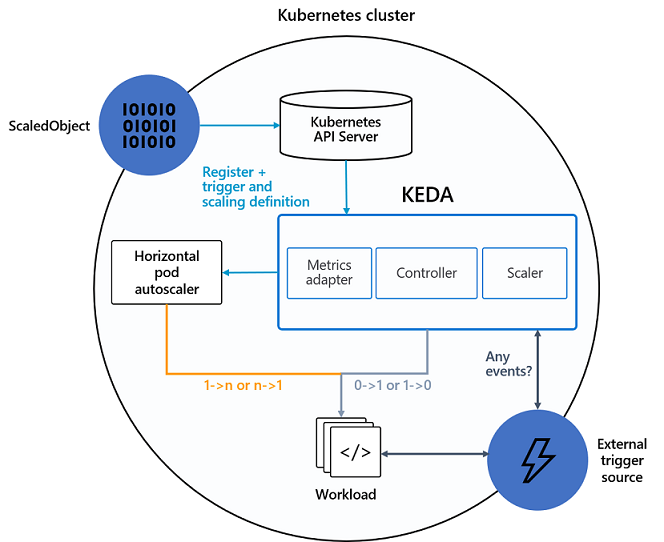

# Auto-scale Containerized Workloads in AKS using KEDA
Reference implementations for using Kubernetes-based Event Driven Autoscaling (KEDA) for scaling containerized workloads hosted on AKS cluster.

## Overview

Kubernetes does resource-based scaling on metrics defined by CPU and memory really well. Event-driven applications require a more targeted solution to scale proactively. With `KEDA`, you can drive the scaling of any workload in Kubernetes based on the number of events/requests needing to be processed.

`KEDA` is a single-purpose and lightweight component that can be added into any Kubernetes cluster. `KEDA` is an open source, `CNCF` solution. It works alongside standard Kubernetes components like the `Horizontal Pod Autoscaler (HPA)` and `Cluster Autoscaler`, and can extend its functionality. With `KEDA`, you can explicitly target the apps you want to use event-driven scale, with other apps continuing to function using other scaling methods. This makes `KEDA` a flexible and safe option to run alongside any number of any other Kubernetes applications or frameworks.

`KEDA` works alongside standard Kubernetes components like the `Horizontal Pod Autoscaler (HPA)`, and the `Cluster Autoscaler`. KEDA extends auto-scaling functionality without overwriting or duplication.

## Architecture

The diagram below shows how KEDA integrates with the Kubernetes HPA, external event sources, and Kubernetes’ API Server to provide autoscaling functionality.

Read about how KEDA works and more in depth details from their [official documentation](https://keda.sh/docs/2.4/concepts/).

## Prerequisites

## Scenarios